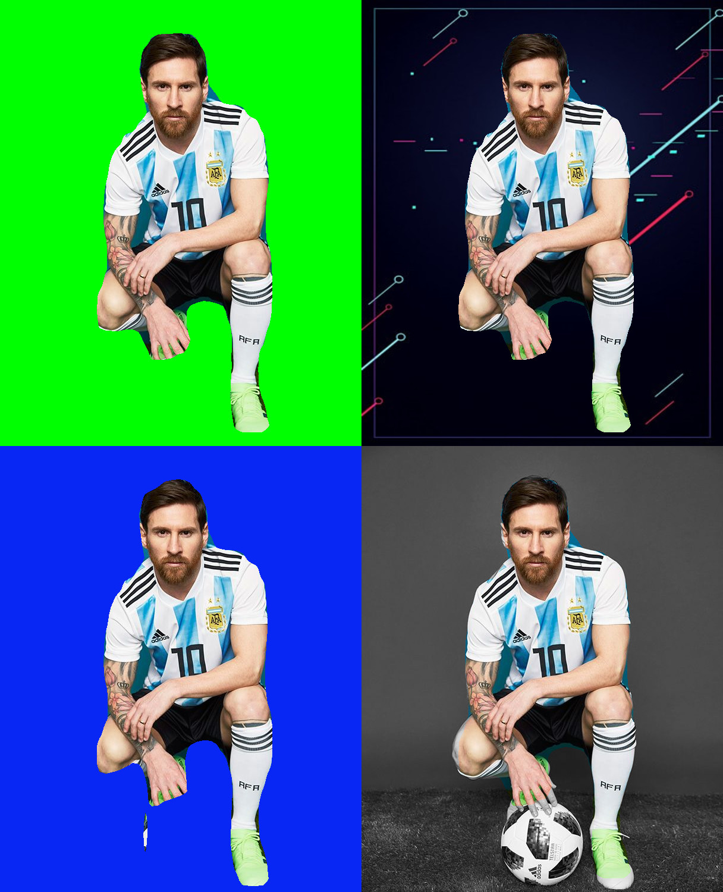

# Entity Isolator | Image/Video Background Removal
This project uses a pretrained MASK-RCNN model to do object detection. This project can be used to isolate the main human entity of an image/video and modify the background to be: 
1.  grayscale | mode = 'gray'
2. green screen | mode = 'green'
3. blue screen | mode = 'blue'
4. an external image as virtual background | mode = 'external' | vbg = path/to/virtual/background

# Model Used
1. Out of the box [pre-trained Mask-RCNN model](https://github.com/matterport/Mask_RCNN/releases/download/v2.0/mask_rcnn_coco.h5) trained on the COCO dataset.

# Demo
## Image

## Video (as gif)

# Requirements
- numpy
- scipy
- Pillow
- cython
- matplotlib
- scikit-image
- tensorflow==1.15.2
- protobuf==3.20
- keras==2.2.4
- opencv-python
- h5py==2.10.0
- imgaug
- IPython[all]
- Python 3.7

# To-Do

- [ ] Enable support for video virtual background
- [ ] Create proof-of-concept app
- [ ] Enhance edge detection / edge handling
- [ ] Enable support for webcam input (currently not implemented due to my hardware limitations)

# Usage

## Create Environment
type this command in terminal/cmd/conda prompt:  
`conda env create -f mask_rcnn.yml`
## Install Requirements
type this command in terminal/cmd/conda prompt:  
`pip install -r requirements.txt`
## Run main.py

# Attributions
1. [Demo Video Source](https://www.youtube.com/shorts/HM9aWSg4D1E)
